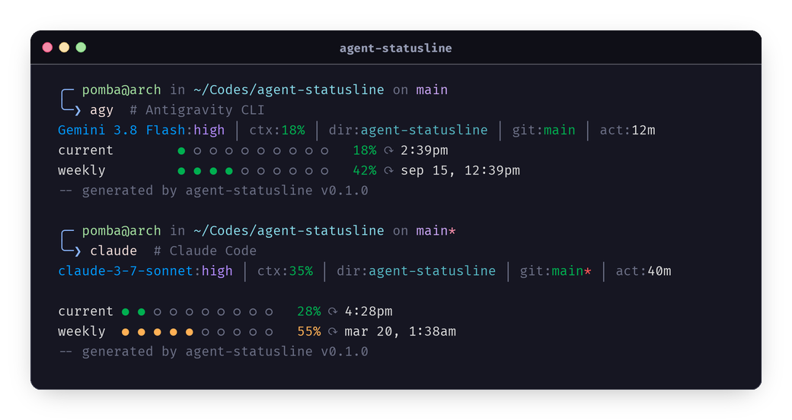

# agent-statusline

Fast, lightweight statusline generator for **Antigravity CLI** and **Claude Code**, written in Rust.



## Features

- ⚡ **Ultra Fast & Lightweight**: Compiled Rust binary with minimal overhead and zero lag in your shell/agent loops.
- 🤖 **Multi-Agent Support**: Automatic detection for both **Antigravity CLI** (`agy`) and **Claude Code** (`claude`), with manual overrides available.
- 📊 **Rich Metrics**:
  - Active model name & reasoning effort level (`high`, `medium`, `low`, etc.)
  - Context window usage percentage with dynamic color coding
  - Current directory name
  - Git branch and dirty state indicator (`*`)
  - Git worktree detection
  - Total activity / session duration
- ⏳ **Quota & Rate Limits**:
  - Visual dot progress bars (`●` / `○`) for current session and weekly usage
  - Accurate countdown / reset timestamps (`⟳`)
  - 3rd party model quota handling
- ⚙️ **Configurable**: Toggle bottom-right generator attribution tag (`--no-tag`, `--show-tag`).

---

## Installation

```bash
cargo install --git https://github.com/pombadev/agent-statusline.git
```

---

## Configuration

### Antigravity CLI

Add the statusline command to your Antigravity CLI settings file (`~/.gemini/antigravity-cli/settings.json`):

```json
{
  "statusLine": {
    "type": "command",
    "command": "agent-statusline",
    "enabled": true
  }
}
```

### Claude Code

Add the statusline configuration to your Claude Code settings file (`~/.claude/settings.json`):

```json
{
  "statusLine": {
    "type": "command",
    "command": "agent-statusline --claude",
    "enabled": true
  }
}
```

---

## Usage

`agent-statusline` reads JSON state passed via standard input (`stdin`):

```bash
# Auto-detect agent mode based on JSON payload
agent-statusline < state.json

# Force Antigravity mode
agent-statusline --antigravity < state.json

# Force Claude Code mode
agent-statusline --claude < state.json

# Hide generator attribution tag
agent-statusline --no-tag < state.json
```

### Options

| Flag | Description |
|------|-------------|
| `-a`, `--agy`, `--antigravity` | Force Antigravity mode |
| `-c`, `--claude` | Force Claude Code mode |
| `--show-tag` | Show generator tag (enabled by default) |
| `--no-tag` | Do not show generator tag |
| `-h`, `--help` | Print help information |
| `-V`, `-v`, `--version` | Print version information |

---

## License

MIT
